<div align="center">
  <h1>flowerpay-ai 鲜花商店 + ai</h1>
  <h5>后端利用 Spring Boot 3 的高效与安全性提供 RESTful API 服务，前端借助 Vue 3 实现流畅的用户交互体验的构建的现代化前后端分离系统。通过多级缓存热点数据以提升系统响应速度，Druid 负责MySQL连接池与 SQL 监控，保障订单、库存数据访问；使用redis_exporter采集多级缓存命中率使用情况，监视redis。</h5>
    <h5>主业务为B2C经营模式，一个花店卖家，多个买家，由店长、店员和客户组成，前台鲜花经营及RBAC后台管理系统,统计数据分析,店铺管理,博客发布更新和评论服务，优惠卷秒杀服务。分支业务org.springframework.ai的openai +com.alibaba.cloud.ai的graph，问一问rag的使用用途和送人对象，拍一拍识别推荐花束。</h5>
</div>

---

## 配置说明

<div align="center">
    <h1>
    
    
    
    
    
    
    
    </h1>
</div>
---
## 接口和项目结构

<div align="center">
    <h5>flowerpay-ai\说明\admin接口文档.md</h5>			
    <h5>flowerpay-ai\说明\admin接口文档.md</h5>
    <h5>flowerpay-ai\说明\wiki.md</h5>
</div>
---

# 前端说明

## admin端

|  | 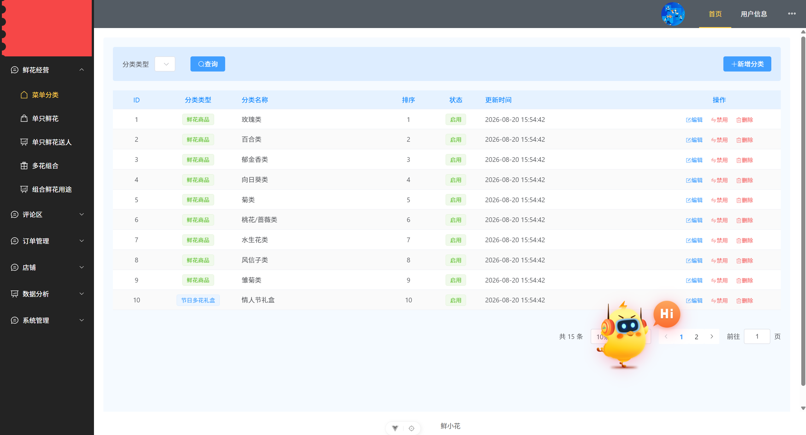 |  |
| :----------------------------------------------------------: | :----------------------------------------------------------: | ------------------------------------------------------------ |
|  |  |  |
|  |  |  |
|  |  |                                                              |
| 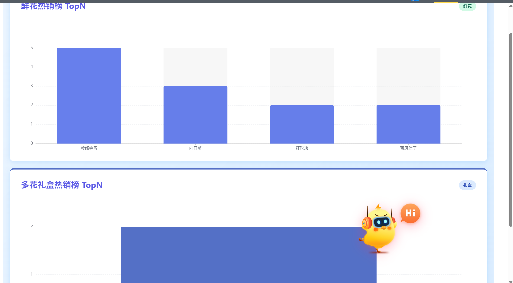 | 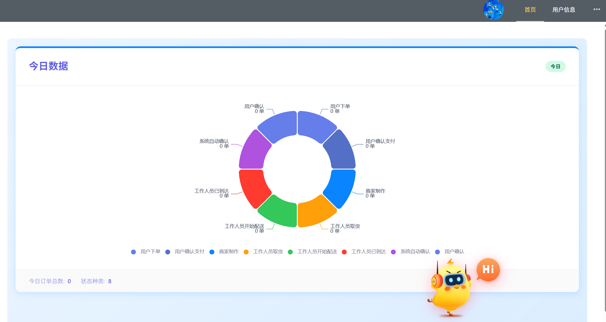 | 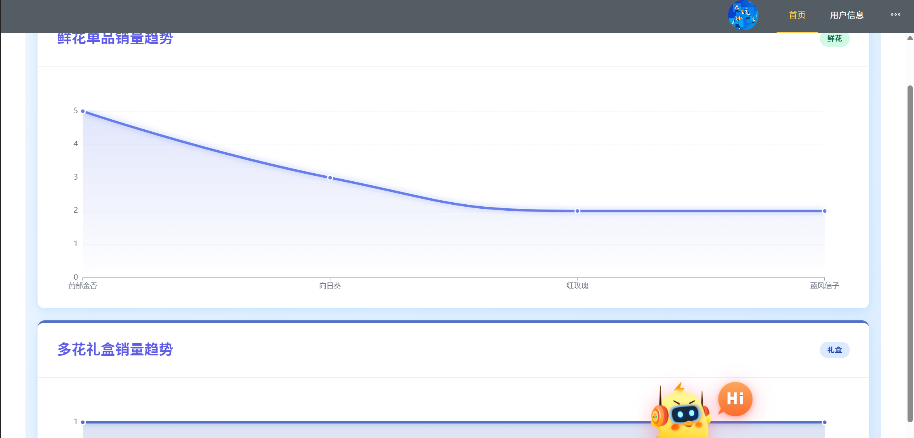 |

## 用户端

| 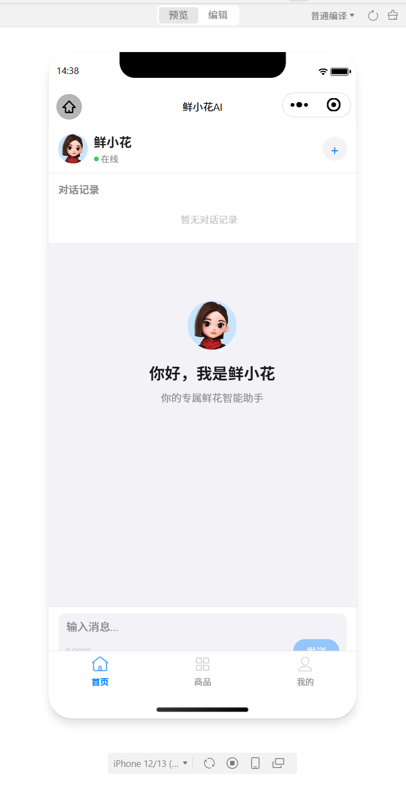 | 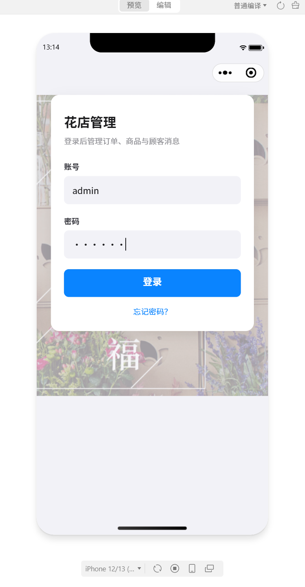 | 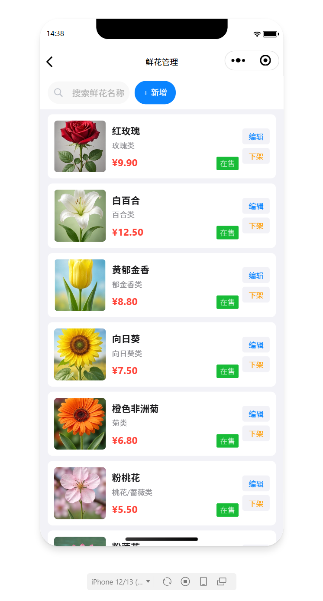 |
| ------------------------------------------------------------ | ------------------------------------------------------------ | ------------------------------------------------------------ |
| 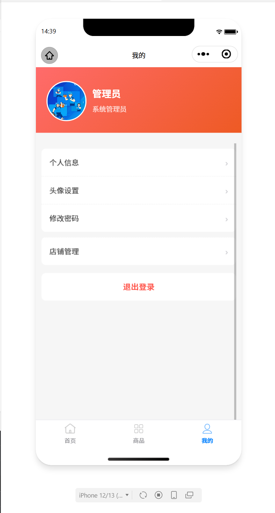 | 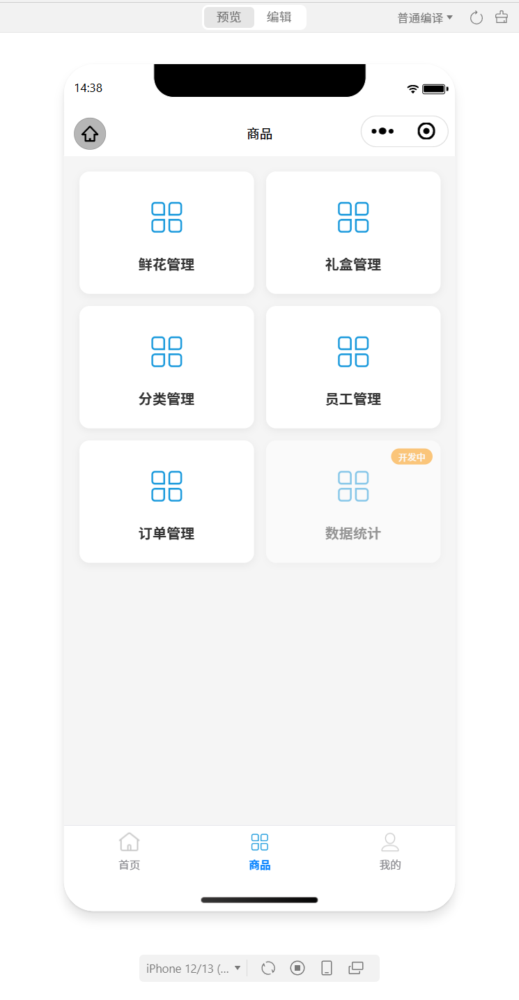 |                                                              |

## AI

| 点击切换出浮空窗口 |  | 1    | 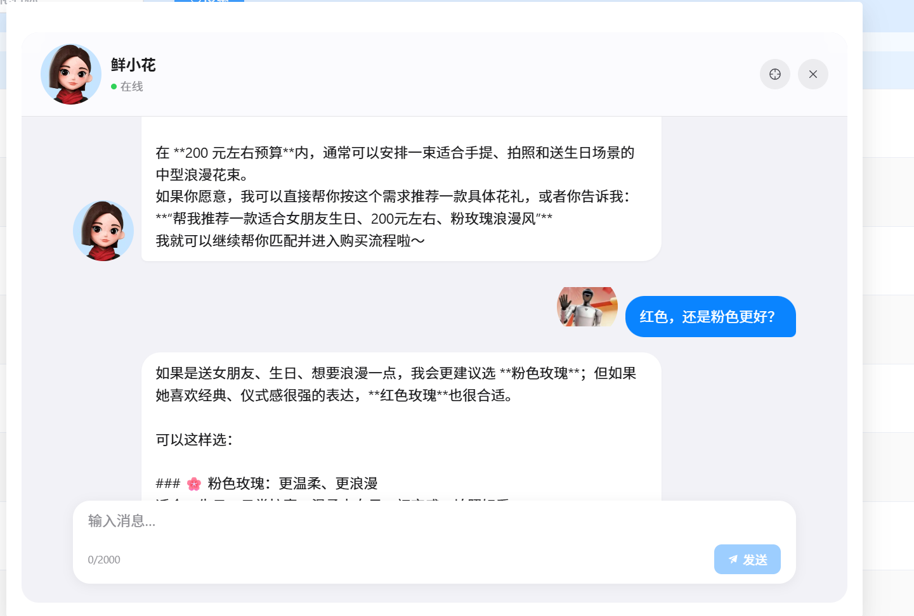 |
| ------------------ | ------------------------------------------------------------ | ---- | ------------------------------------------------------------ |
| 2                  | 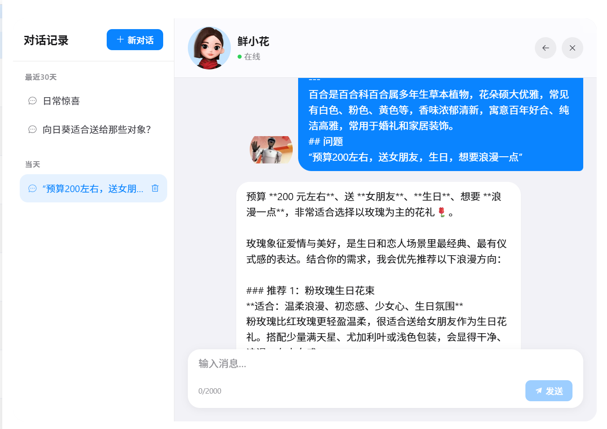 | 3    | 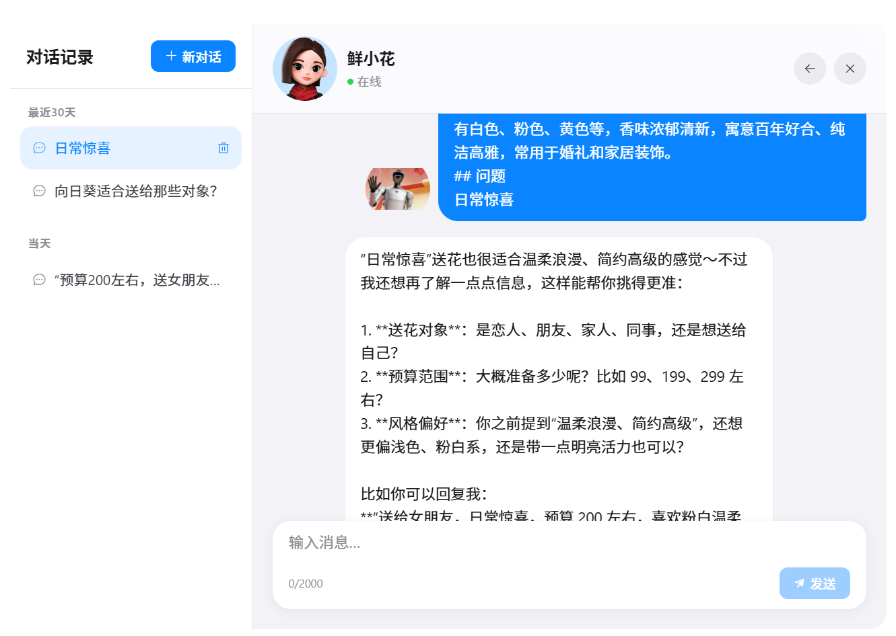 |

# 后端说明

## 多端登录模块

### model

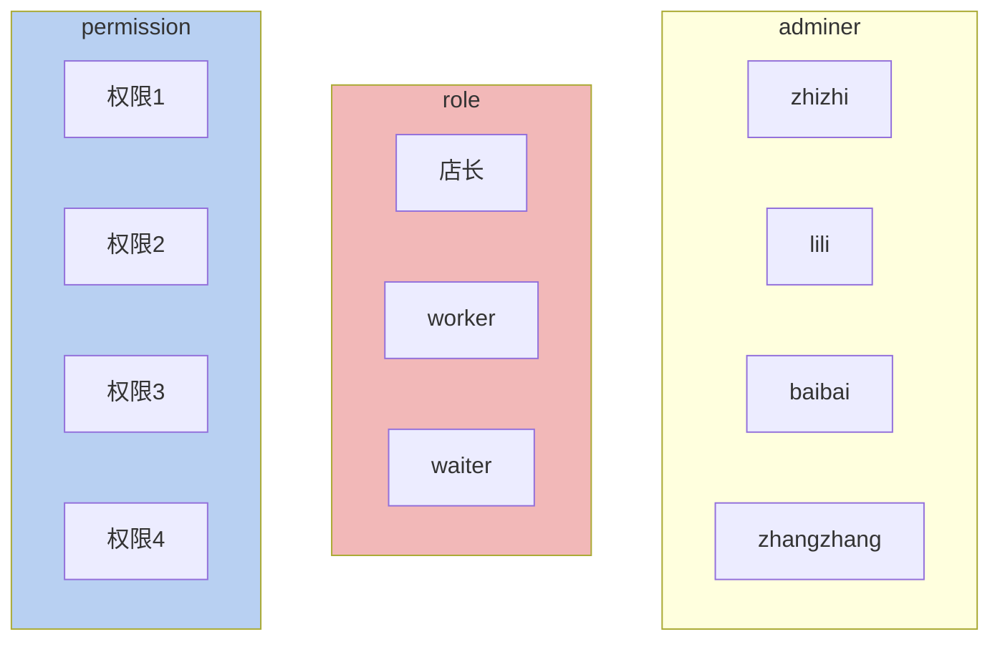
```mermaid
flowchart TB
    subgraph adminer
        zhi["zhizhi"]
        li["lili"]
        bai["baibai"]
        zhang["zhangzhang"]
    end
    subgraph role
        keyan["店长"]
        shichang["worker"]
        xiaoshou["waiter"]
    end
    subgraph permission
        start1["权限1"]
        start2["权限2"]
        start3["权限3"]
        start4["权限4"]
       
    end

    classDef c1 fill:#fff
    classDef c2 fill:#f2b8b8
    classDef c3 fill:#b8d0f2
    class admin c1
    class role c2
    class permission c3
```

### 迭代过程

```
Q：滑动过期会不会产生大量无效 Redis Key？
答：设置最大基础 TTL 兜底，即使用户长期不操作，缓存自动(expire:24小时)淘汰；登出接口主动删除对应 key，减少无效缓存堆积。
Q: 如何保证role权限？
1.user和admin的url拦截
.authorizeHttpRequests(  auth -> auth           		
	.requestMatchers("/admin/**").hasRole("ADMIN")
	.requestMatchers("/user/**").hasRole("USER")
	// 其他接口全部放行
	.anyRequest().permitAll())
2.admin不同的角色的使用层拦截
@PreAuthorize("hasRole('ADMIN')")，@PreAuthorize("hasAuthorize('admin:create')")，@PreAuthorize("hasAuthorize('work:create')")等等
```

------

## 鲜花商品模块

| 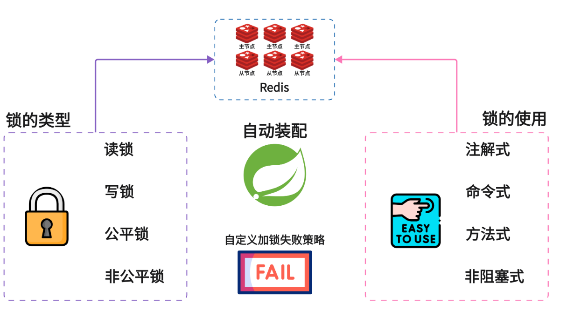 |  |
| ------------------------------------------------------------ | ------------------------------------------------------------ |

### model

1. flower-category索引：type 普通索引

   按类型快速筛选分类，优化 type查询速度

2. 鲜花单品模块

- 分类：鲜花单品 = 1 : N（`flower.category_id`关联分类表）

3. 多花组合模块

- 关系：`festival` : `festival_detail` = 1 : N
- 索引：index idx_festival_id (festival_id)、index idx_flower_id (flower_id)，优化 ORDER BY 和 GROUP BY 操作

---

对于这些热点信息使用多级缓存


```mermaid
%%{init: {'theme':'neutral','themeVariables':{'fontSize':'8px','nodeBorder':'2px'},'flowchart':{'nodeSpacing':8,'rankSpacing':32,'useMaxWidth':false,'curve':'basis'}}}%%
flowchart LR
    direction LR
    User[用户发起请求]

    subgraph L0 [客户端层]
        Browser[浏览器缓存]
    end

    subgraph L1 [网络层]
        CDN[CDN 网络缓存]
    end

    subgraph L2 [网关接入层]
        NginxProxy[Nginx 反向代理集群]
        NginxCache[业务 Nginx 网关层缓存]
    end

    subgraph L3 [应用数据层]
        LocalCache[应用进程缓存]
        Redis[Redis 分布式缓存集群]
    end

    subgraph L4 [数据持久层]
        DB[(数据库)]
    end

    User --> Browser
    Browser -- 未命中 --> CDN
    CDN -- 未命中/回源 --> NginxProxy
    NginxProxy --> NginxCache
    NginxCache -- 未命中 --> LocalCache
    LocalCache -- 未命中 --> Redis
    Redis -- 未命中 --> DB

    DB -- 返回数据 --> Redis
    Redis --> LocalCache
    LocalCache --> NginxCache
    NginxCache --> NginxProxy
    NginxProxy --> CDN
    CDN --> Browser
    Browser --> User
```

**1 redis预热**

使用@PreConstruct+@PreDestory管理

**2 DB查询**

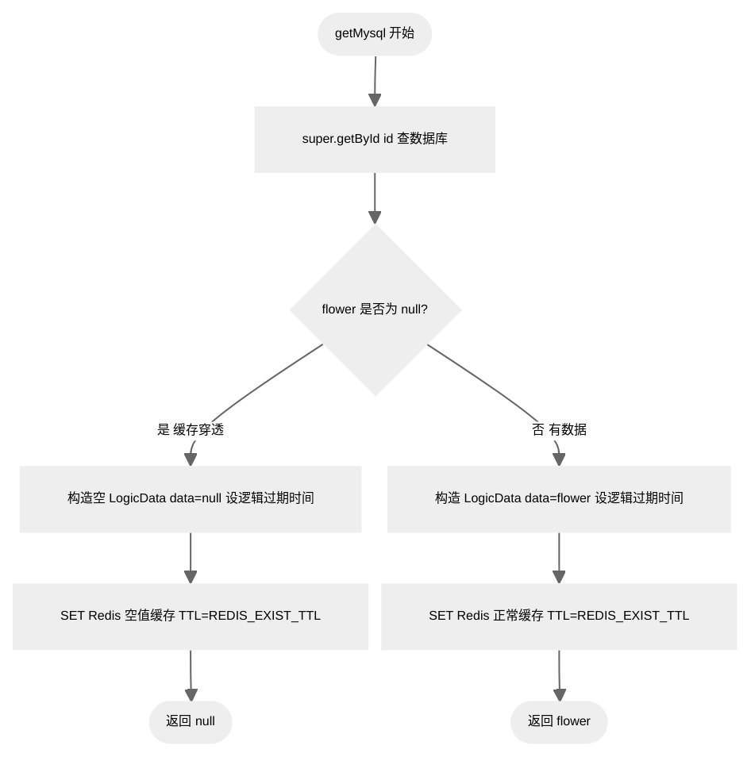
```mermaid
%%{init: {'theme':'neutral','themeVariables':{'fontSize':'8px','nodeBorder':'2px'},'flowchart':{'nodeSpacing':8,'rankSpacing':32,'useMaxWidth':false,'curve':'basis'}}}%%
flowchart TD
    S([getMysql 开始]) --> A[super.getById id 查数据库]
    A --> B{flower 是否为 null?}
    B -->|是 缓存穿透| C[构造空 LogicData data=null 设逻辑过期时间]
    B -->|否 有数据| D[构造 LogicData data=flower 设逻辑过期时间]
    C --> E[SET Redis 空值缓存 TTL=REDIS_EXIST_TTL]
    D --> F[SET Redis 正常缓存 TTL=REDIS_EXIST_TTL]
    E --> G([返回 null])
    F --> H([返回 flower])
```

**3 因为flower，festival模块的价格存在因为节日，花的保质期限制处于动态变化，异步更新后拿到新数据，返回新数据**

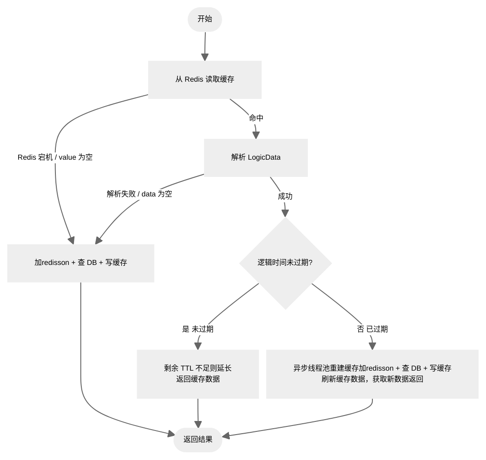
```mermaid
%%{init: {'theme':'neutral','themeVariables':{'fontSize':'8px','nodeBorder':'2px'},'flowchart':{'nodeSpacing':8,'rankSpacing':32,'useMaxWidth':false,'curve':'basis'}}}%%
flowchart TD
    S([开始]) --> A[从 Redis 读取缓存]
    A -->|Redis 宕机 / value 为空| B[加redisson + 查 DB + 写缓存]
    A -->|命中| C[解析 LogicData]
    C -->|解析失败 / data 为空| B
    C -->|成功| D{逻辑时间未过期?}
    D -->|是 未过期| E[剩余 TTL 不足则延长<br/>返回缓存数据]
    D -->|否 已过期| F["异步线程池重建缓存加redisson + 查 DB + 写缓存<br>刷新缓存数据，获取新数据返回"]
    B --> R([返回结果])
    E --> R
    F --> R
```

**4 flower-detial，festival-detail使用传统逻辑过期处理**

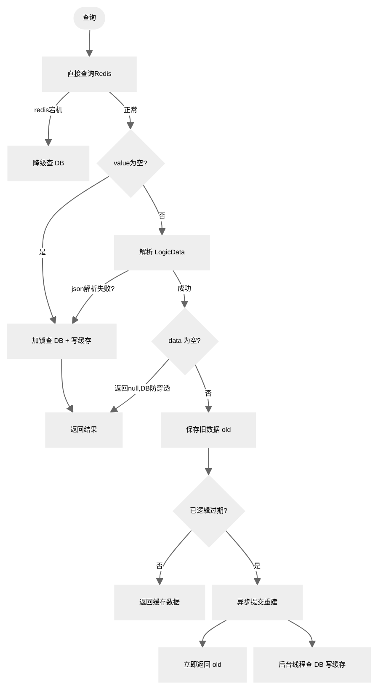
```mermaid
%%{init: {'theme':'neutral','themeVariables':{'fontSize':'8px','nodeBorder':'2px'},'flowchart':{'nodeSpacing':8,'rankSpacing':32,'useMaxWidth':false,'curve':'basis'}}}%%
flowchart TD
    S([查询]) --> A[直接查询Redis]
    A -->|redis宕机| B[降级查 DB]
    A -->|正常| C{value为空?}
    C -->|是| D[加锁查 DB + 写缓存]
    C -->|否| E[解析 LogicData]
    D --> R[返回结果]
    E -->|json解析失败?| D
    E -->|成功| F{data 为空?}
    F -->|返回null,DB防穿透| R
    F -->|否| G[保存旧数据 old]
    G --> H{已逻辑过期?}
    H -->|否| I[返回缓存数据]
    H -->|是| J[异步提交重建]
    J --> K[立即返回 old]
    J --> L[后台线程查 DB 写缓存]
```


### 迭代过程

|           早期问题           |                           我的方案                           |
| :--------------------------: | :----------------------------------------------------------: |
|           缓存穿透           |          空值缓存 + 短 TTL60s，查询为空也写入 Redis          |
|           缓存击穿           | 逻辑过期 + Redisson 分布式锁 + 异步重建；持锁线程异步更新，其余请求返回旧缓存 |
|           缓存雪崩           | 基础 TTL 叠加 ±10% 随机偏移；列表、详情缓存设置不同过期周期  |
|       缓存数据库一致性       |                       兜底物理 TTL24h                        |
| 悲观锁不能解决集群和并发问题 | Redisson 可重入分布式锁 + 看门狗自动续期；加锁后双重检查缓存 |
|    redis宕机的突发性问题     |                 Redis 不可用：降级直查数据库                 |

排除冷启动的达到稳定，进行统计

无缓存的情况是全程没有使用 redis 的稳定情况

有缓存的情况是全程有 redis 的稳定情况

| category                                                     |  |
| ------------------------------------------------------------ | ------------------------------------------------------------ |
| 没有缓存，并发1000次                                         |     |
| 没有缓存，并发1000次                                         |     |
| 没有缓存，并发1000次                                         |     |
| 日志                                                         | flowerpay-ai/说明/并发测试/flower-category-运行日志-没有缓存日志.txt |
| 有spring-cache缓存，再并发1000次                             |         |
| 有spring-cache缓存，再并发1000次                             |         |
| 有spring-cache缓存，再并发1000次                             |         |
| 日志                                                         | flowerpay-ai/说明/并发测试/flower-category-运行日志-缓存日志.txt |
| 计算说明：性能提升百分比 =(无缓存值‑有缓存值)/ 无缓存值 ×100%；吞吐量提升百分比 =(有缓存‑无缓存)/ 无缓存 ×100%。 | **吞吐量**：无缓存吞吐量 21.8 请求 / 秒；开启缓存吞吐量提升至 29.7 请求 / 秒，吞吐量提升**36.2%**，系统整体并发处理能力增强。 **网络流量**：接收速率从 43.46KB/sec 提升至 59.09KB/sec，发送速率从 7.93KB/sec 提升至 10.78KB/sec，单位时间网络数据处理能力随吞吐量同步上涨。 |

| flower                                                       |     |
| ------------------------------------------------------------ | ------------------------------------------------------------ |
| 没有缓存，再开启 500次并发                                   |              |
| 没有缓存，再开启 500次并发                                   |              |
| 日志                                                         | flowerpay-ai/说明/并发测试/flower-运行日志-没有缓存.txt      |
| 有redis缓存，再开启 500次并发                                |                  |
| 有redis缓存，再开启 500次并发                                |                  |
| 日志                                                         | flowerpay-ai/说明/并发测试/flower-运行日志-缓存.txt          |
| 90% Line 含义：90% 的请求响应耗时不大于该数值，分位数指标用于评估接口稳定性，相比平均响应时间更能反映真实用户访问体验。 | 无缓存场景：90% 请求响应时间 1633ms，95% 请求响应时间 1751ms，99% 请求响应时间 1844ms。 开启缓存场景：90% 请求响应时间 193ms，95% 请求响应时间 237ms，99% 请求响应时间 266ms。<br> 90 分位：响应时间下降 88.18%； 95 分位：响应时间下降 86.46%； 99 分位：响应时间下降 85.57%。 |

| festival                      |   |
| ----------------------------- | ------------------------------------------------------------ |
| 没有缓存，再开启 500次并发    |            |
| 没有缓存，再开启 500次并发    |            |
| 日志                          | flowerpay-ai/说明/并发测试/festival-运行日志-没有缓存.txt    |
| 有redis缓存，再开启 500次并发 |                |
| 有redis缓存，再开启 500次并发 |                |
| 日志                          | flowerpay-ai/说明/并发测试/festival-运行日志-缓存.txt        |
| 对比                          | 无缓存场景：接口平均响应时间 761ms，90% 请求响应时间 1595ms，95% 请求响应时间 1629ms，99% 请求响应时间 1746ms，吞吐量 34.3 次每秒，错误率 0%。 开启缓存场景：接口平均响应时间 136ms，90% 请求响应时间 327ms，95% 请求响应时间 346ms，99% 请求响应时间 423ms，吞吐量 150.6 次每秒，错误率 0%。 |

## 文章和评论模块


### 迭代过程

Q：为什么点赞用Redis的ZSet而不是普通Set？

> A：ZSet可以存储分数（timestamp），这样可以按点赞时间排序，方便获取热门点赞用户。同时ZSet的score操作是原子的，不会出现并发问题。

Q：为什么点赞数同时存Redis和MySQL？

> A：Redis用于实时查询和计数，MySQL用于持久化存储。点赞操作先更新MySQL再更新Redis，保证数据最终一致性。

Q：为什么用parent_id区分评论和回复？

> A：`parent_id = 0` 表示直接评论博文，`parent_id = 1` 表示回复其他评论。这种设计可以支持无限层级的回复，同时查询时可以通过parent_id区分评论和回复。

## 优惠券使用模块

### 组件：ID生成器（RedisID）

```java
@Component
public class RedisID {
    // 基准时间：2020-01-01 00:00:00 UTC
    private final static long BEGIN_TIME = 1577836800L;
    // 32位序号最大值
    private static final long MAX_SEQ = 0xFFFFFFFFL;

    public long createId(String prefix) {
        long nowSeconds = ZonedDateTime.now(ZoneOffset.UTC).toEpochSecond();
        long timestamp = nowSeconds - BEGIN_TIME;
        
        String date = ZonedDateTime.now(ZoneOffset.UTC)
            .format(DateTimeFormatter.ofPattern("yyyy:MM:dd"));
        String key = "icr:" + prefix + ":" + date;
        long count = stringRedisTemplate.opsForValue().increment(key);
        
        return timestamp << 32 | count;
    }
}
```

Q：为什么不用UUID？

> A：UUID是随机字符串，无序，作为数据库主键会导致索引分裂，影响性能。而且UUID太长（36位），存储和传输成本高。

Q：为什么不用数据库自增ID？

> A：数据库自增ID在分布式环境下需要额外处理（比如分库分表），而且生成ID需要访问数据库，性能不如Redis。

Q：ID结构为什么是 1位符号位+时间戳(31位) + 序号(32位)？

> A：0作为符号位，正数自增，31位时间戳可以表示约68年（2^31秒 ≈ 68年），从2020年开始够用。32位序号可以表示约42亿，足够单日并发使用

### 秒杀流程图

**同步版本流程**

```
用户请求 → 校验秒杀活动 → 生成订单ID → 直接调用secondKill() → 扣库存+保存订单 → 返回结果
```

**异步单机流程**

```
用户请求 → 校验秒杀活动 → Lua脚本校验 → 放入ArrayBlockingQueue → 返回订单ID
                                                              ↓
                                        后台线程 take() → RedisLock → paySuccess() → 扣库存+保存订单
```

**异步分布式流程**

```
用户请求 → 校验秒杀活动 → Lua脚本校验（自动XADD到Stream）→ 返回订单ID
                                                         ↓
                                XREADGROUP读取 → 解析订单 → secondKill() → 扣库存+保存订单 → ACK确认
```

**数据库操作阶段**

1. **一人一单校验**：在事务中基于用户ID和优惠券ID查询已存在订单
2. **原子库存扣减**：使用 MyBatis Plus 的乐观锁 CAS 操作保证库存扣减的原子性
3. **订单创建**：保存订单记录

```
用户请求 → Lua脚本校验（库存+重复下单）→ 成功
								  ↓ →放入异步队列 → 后台线程处理（扣库存+保存订单）
                                  ↓ →失败→直接返回
```

**redis操作阶段**：

```lua
-- 参数：优惠券ID、用户ID
local voucherId = ARGV[1]
local userId = ARGV[2]

-- Redis Key定义
local stockKey = "voucherSeckill:stock:" .. voucherId
local orderKey = "voucherSeckill:order:" .. voucherId

-- 1. 判断库存
if tonumber(redis.call('get', stockKey)) <= 0 then
    return 1  -- 库存不足
end

-- 2. 判断是否已下单
if redis.call('sismember', orderKey, userId) > 0 then
    return 2  -- 重复下单
end

-- 3. 扣减库存
redis.call('incrby', stockKey, -1)

-- 4. 记录下单用户
redis.call('sadd', orderKey, userId)

-- 5. 成功
return 0
```

###  迭代过程

| 维度           | VoucherSeckillController | VoucherController  | VoucherOrderController |
| :------------- | :----------------------- | :----------------- | :--------------------- |
| **处理方式**   | 同步                     | 异步               | 异步（Redis Stream）   |
| **队列类型**   | 无                       | ArrayBlockingQueue | Redis Stream           |
| **多服务支持** | 支持                     | 不支持             | 支持（消费组）         |
| **故障恢复**   | 无状态                   | 重启丢失           | 消息可恢复             |

---

## 订单模块

### model

```
→ 1 用户下单 → 2 用户确认支付 
→ 3 商家制作 → 4 工作人员取货 → 5 工作人员开始配送 → 6 工作人员已到达 → 7 用户确认
→ 8 已取消（未接单退款、商家拒单、超时取消、退款）
```

第三方授权登录流程图和支付流程：支付宝

`沙箱网关固定为：https://openapi-sandbox.dl.alipaydev.com/gateway.do`

| 支付宝授权     | 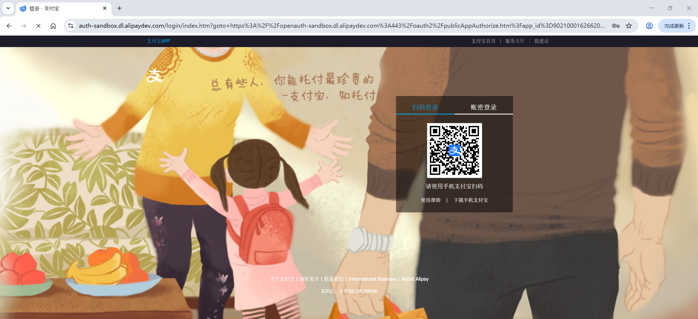 |
| -------------- | ------------------------------------------------------------ |
| 第三方授权成功 | 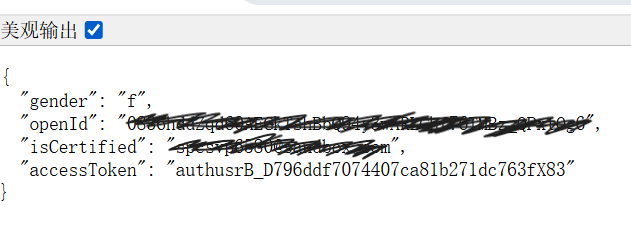 |
| 支付集成到订单 | 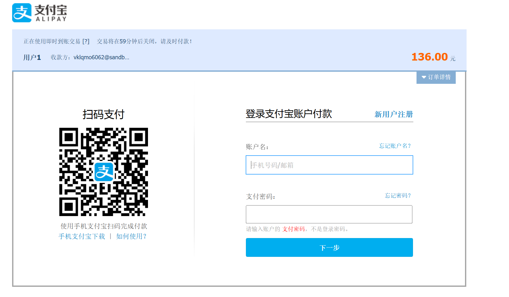 |
| 支付过程       | 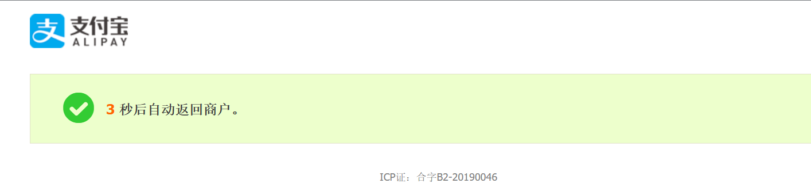 |
| 同步支付结果   | 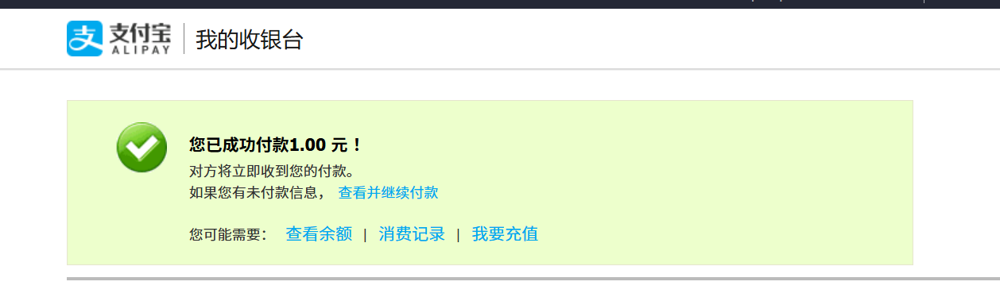 |
| 异步验签结果   | 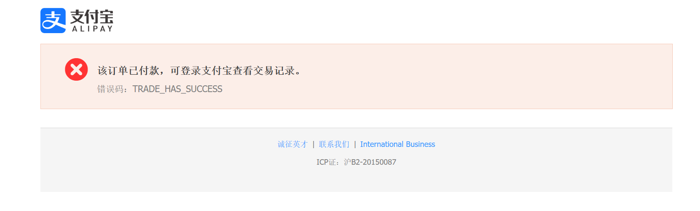 |

## 用户模块

### model

user-address

```
Q:多默认地址数据违规，新增 / 修改地址勾选默认，旧默认地址未取消？
设为默认前先批量更新该用户所有地址 isDefault=0，两步操作绑定业务逻辑，数据库无法直接约束单用户唯一默认，代码层前置清理旧默认，保证业务数据合规
Q:用户地址数量较多时，需要扫描前 100 页数据，游标滚动分页，以上一页最后一条 id 作为游标，直接走主键索引
```

websocket

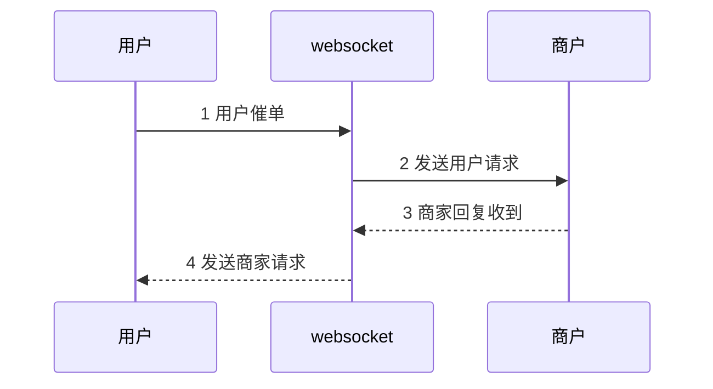
```mermaid
sequenceDiagram
    participant 用户
    participant websocket
    participant 商户

    用户->>websocket:1 用户催单
    websocket->>商户:2 发送用户请求
    商户-->>websocket:3 商家回复收到
    websocket-->>用户:4 发送商家请求
```

user-shopping

```
Q:MySQL 持久化，还采用 Redis Hash 存储?
节假日使用redis，平时使用MySQL。
Q:Redis Hash 结构
   外层 key：shopping_cart:{userId}
   内层 field：购物项唯一 id，value：商品完整信息 JSON
```

## 文件管理模块

### model

1 使用excel分析

POST /report/excel/read EasyExcel流式逐行读取解析，不加载全表到内存
GET /report/excel/download 流式写入Response输出流，边写边返回，不占用堆内存

2 文件管理

双存储环境隔离，使用硬盘存储，对于内部的用户数据，敏感数据和重要文档。切换 OSS 加速、多实例共享文件、无限扩容，存储公共数据。

UUID 重命名策略，丢弃原始文件名，UUID + 后缀生成全新文件名，解决重名覆盖、路径遍历攻击、中文乱码三大问题。

## 接入AI模块

### model

chat_session（session表）：存储的是“会话”维度的信息，以 session_id（业务ID）为唯一索引，记录session。
chat_record（chat表）：存储的是具体的“对话消息”维度的信息，以 conversation_id 为索引, 上下文记忆。

chat_session : chat_record =  1:N

### 拍一拍识别推荐花束

spring alibaba graph 编排流程图：

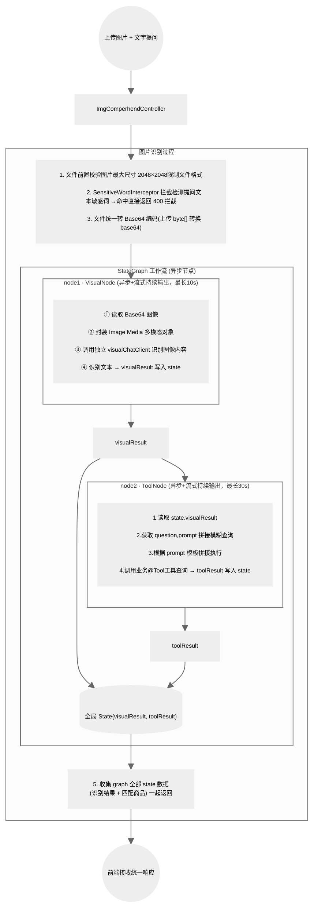
```mermaid
%%{init: {'theme':'neutral','themeVariables':{'fontSize':'8px','nodeBorder':'2px'},'flowchart':{'nodeSpacing':8,'rankSpacing':32,'useMaxWidth':false,'curve':'basis'}}}%%
flowchart TD
    Start(("上传图片 + 文字提问"))
    C["ImgComperhendController"]

    subgraph CHAIN ["图片识别过程"]
        direction TB
        S1["1. 文件前置校验图片最大尺寸 2048×2048限制文件格式<br/>
        	2. SensitiveWordInterceptor 拦截检测提问文本敏感词 →命中直接返回 400 拦截<br/>
        	3. 文件统一转 Base64 编码(上传 byte[] 转换base64)"]
        
        subgraph GRAPH ["StateGraph 工作流 (异步节点)"]
            direction TB
  
            subgraph VGROUP ["node1 · VisualNode (异步+流式持续输出，最长10s)"]
                direction TB
                V1["① 读取 Base64 图像<br/>
                	② 封装 Image Media 多模态对象<br/>
                	③ 调用独立 visualChatClient 识别图像内容<br/>
                	④ 识别文本 → visualResult 写入 state"]
            end
            
            visualResult["visualResult"]
            
            subgraph TGROUP ["node2 · ToolNode (异步+流式持续输出，最长30s)"]
                direction TB
                INPUT1["1.读取 state.visualResult<br/>
                2.获取 question,prompt 拼接模糊查询<br/>
                3.根据 prompt 模板拼接执行<br/>
                4.调用业务@Tool工具查询 → toolResult 写入 state"]
                end
            
            toolResult["toolResult"]
            ST[("全局 State{visualResult, toolResult}")]
            
            %% 节点间数据流连接
            VGROUP --> visualResult
            visualResult --> TGROUP
            visualResult --> ST
            TGROUP --> toolResult
            toolResult --> ST
        end

        S5["5. 收集 graph 全部 state 数据<br/>(识别结果 + 匹配商品) 一起返回"]
    end

    End(("前端接收统一响应"))

    %% 主流程串联
    Start --> C --> S1
    S1 --> VGROUP
    ST --> S5 --> End
```

### 问一问rag的使用用途，送人对象

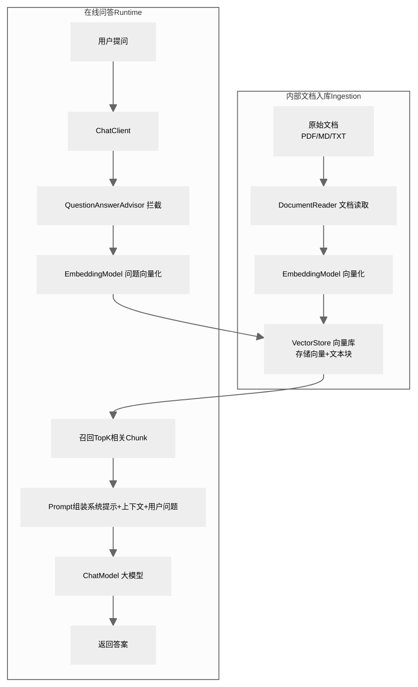
```mermaid
%%{init: {'theme':'neutral','themeVariables':{'fontSize':'8px','nodeBorder':'2px'},'flowchart':{'nodeSpacing':8,'rankSpacing':32,'useMaxWidth':false,'curve':'basis'}}}%%
flowchart TD
    subgraph 内部文档入库Ingestion
        D[原始文档<br/>PDF/MD/TXT]
        D --> DR[DocumentReader 文档读取]
        DR --> EM1[EmbeddingModel 向量化]
        EM1 --> VS[VectorStore 向量库<br/>存储向量+文本块]
    end

    subgraph 在线问答Runtime
        U[用户提问]
        U --> CC[ChatClient]
        CC --> QA[QuestionAnswerAdvisor 拦截]
        QA -->  EM2[EmbeddingModel 问题向量化]
        EM2 --> VS
        VS --> R[召回TopK相关Chunk]
        R --> P[Prompt组装系统提示+上下文+用户问题]
        P --> LLM[ChatModel 大模型]
        LLM --> A[返回答案]
    end
```

## 代码生成generator模块

### model

代码生成entity,mapper,service,controller，修改和导入新功能的快速实现

## 运维监测模块

### model

1采用注解 + AOP 切面实现日志统一收集，自定义注解统一采集上下文常用的登录人、请求类型，使用参数，状态、耗时。

```
log.info("role: " + operationType.type+", ID: "+operationType.id+", 执行操作: "+operationType.operation+
        ", 使用参数: "+ message +", 运行状态: "+operationType.status + ", 记录时间: " + time);
```

|       业务难点       |                场景                |                      解决方案                      |                          选型理由                           |
| :------------------: | :--------------------------------: | :------------------------------------------------: | :---------------------------------------------------------: |
| 日志逻辑侵入业务代码 | 每个 CRUD 方法手动写日志，代码冗余 | AOP 切面统一拦截，注解标记即可自动记录，无业务侵入 | 符合 AOP 面向切面设计思想，日志属于横向通用能力，与业务解耦 |

2 监测DB

| 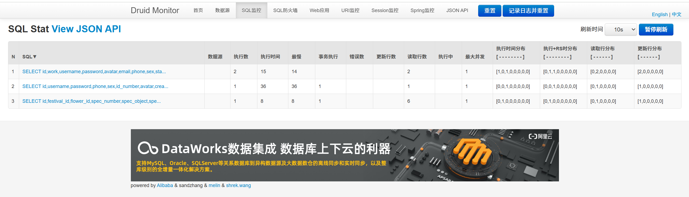 | 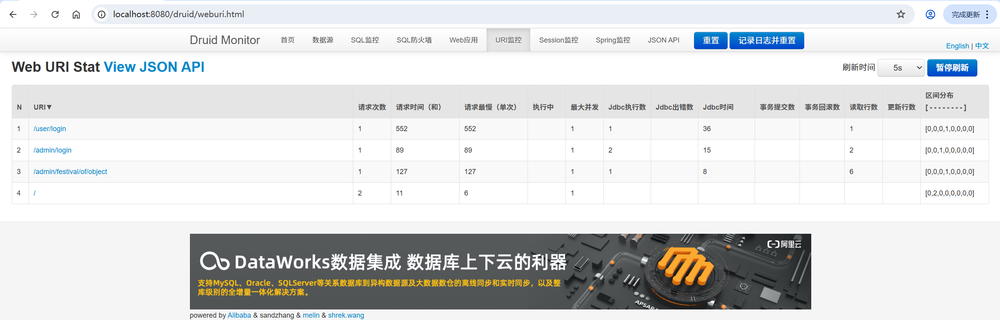 |
| --------------------------------------------------------- | --------------------------------------------------------- |
| 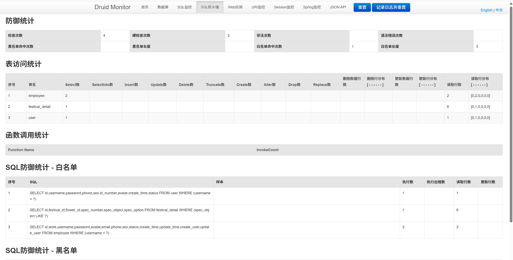 |                                                           |

3 监测redis

| 使用端口9121 | 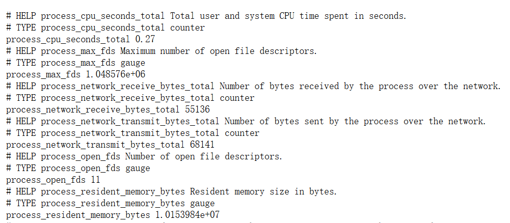 |
| ------------ | ------------------------------------------------------------ |
| 正则匹配     | 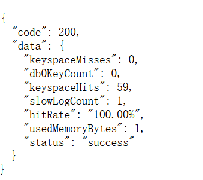 |
